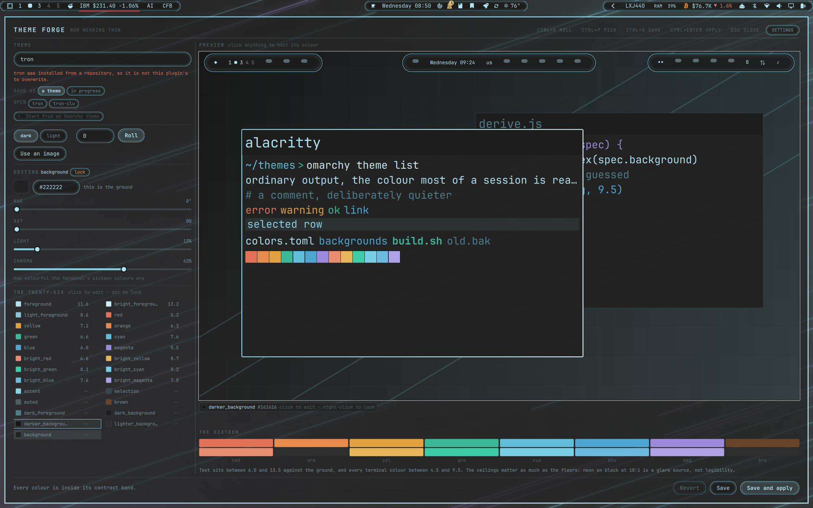

# Theme Forge

Design an Omarchy theme in a real window, and watch a mock desktop wear it while
you work.

Omarchy ships thirty-four `omarchy-theme-*` commands and not one of them makes a
theme. Theme Forge is the missing one: roll a palette, tune any of the
twenty-six colours by hand, or seed the whole thing from a wallpaper — then save
a real theme directory and apply it, with one click to put your old theme back.



---

## Contents

- [What it does](#what-it-does)
- [Requirements](#requirements)
- [Setup](#setup)
- [Quick start](#quick-start)
- [The window](#the-window)
- [Using it](#using-it)
  - [Mode](#mode)
  - [Rolling, and seeds](#rolling-and-seeds)
  - [The three that drive everything](#the-three-that-drive-everything)
  - [Pinning a colour](#pinning-a-colour)
  - [Chroma](#chroma)
  - [The twenty-six, and what the numbers mean](#the-twenty-six-and-what-the-numbers-mean)
  - [Starting from an image](#starting-from-an-image)
  - [Backgrounds](#backgrounds)
  - [Saving, applying, reverting](#saving-applying-reverting)
  - [Opening a theme you already have](#opening-a-theme-you-already-have)
  - [Drafts](#drafts)
- [The `theme-forge` command](#the-theme-forge-command)
- [What a theme actually is](#what-a-theme-actually-is)
- [Publishing a theme you made](#publishing-a-theme-you-made)
- [Troubleshooting](#troubleshooting)
- [Uninstall](#uninstall)
- [Development](#development)

---

## What it does

**Rolls palettes that are actually readable.** Every generated colour is
*solved* for a target contrast ratio against the background, not sampled and
hoped over. Text lands between 6.0 and 13.5 against the ground and every
terminal colour between 4.5 and 9.5. The ceilings matter as much as the floors:
neon on black at 18:1 is a glare source, not legibility. A roll that cannot make
those bands is discarded and re-rolled, so what you see has already passed its
own gate.

**Previews without applying.** The preview pane is a small desktop drawn from
the palette in memory — the bar, two windows wearing the real Hyprland
active-border gradient, a terminal with the sixteen ANSI colours in it, and a
contrast readout per key. It repaints on every slider frame, costs nothing, and
changes nothing on your actual desktop.

**Seeds a theme from a picture.** Point it at a wallpaper and it takes the hue
and the energy from the image, then solves every lightness itself — so a muddy
photograph cannot produce an unreadable terminal.

**Draws a background when you don't have one.** No image, and it renders a
3840×2160 wallpaper from the palette: a ground gradient, an accent bloom, four
faint light traces, and a little grain so the gradient does not band. Roughly
two seconds.

**Tiles like anything else.** It opens as an ordinary window, not a floating
overlay, so Hyprland lays it out under whatever rules you already run. The
window ground is translucent so your wallpaper reads through it — while the
preview and every swatch stay fully opaque, so the colours you are judging are
never tinted by whatever is behind the window.

**Writes a theme Omarchy understands.** `colors.toml` plus `backgrounds/`, in
`~/.config/omarchy/themes/<name>/`.

---

## Requirements

| | | |
|---|---|---|
| Omarchy 4 | required | `omarchy-shell` and Quickshell |
| **ImageMagick** | required for images | Reading colours out of a picture, and drawing backgrounds. Already on a standard Omarchy install. Without it the palette editor still works and the image half greys out with a reason. |
| **python3** | required | Bounded, symlink-refusing file reads and the image header check. Part of a base Arch install. |

**No network access, ever.** Nothing here talks to anything. The only outside
input is a file you pick yourself from the desktop file chooser.

---

## Setup

Four steps. The last one checks the first three.

### 1. Install the plugin

```sh
omarchy plugin add git@github.com:kairos-tech-oh/omarchy-theme-forge.git --enable
```

It will show you the URL and warn that plugins run as unsandboxed code inside
your long-lived `omarchy-shell` process, then ask you to confirm. That warning
is correct and applies to this plugin as much as any other — the code is short
and commented, and `SUBMISSION-NOTES.md` walks through everything it touches.
Add `--yes` if you are scripting it and have already read the code.

`--enable` matters: a third-party plugin has to be listed in
`~/.config/omarchy/shell.json` before the shell will load it at all. If you
installed without it:

```sh
omarchy plugin enable kairos.theme-forge
```

Then restart the shell so it picks the plugin up:

```sh
omarchy restart shell
```

> This restarts your bar, lock screen and polkit agent for a second. It refuses
> to run while the session is locked.

### 2. Add a keybinding

Theme Forge has no bar widget, so give it a way in. Omarchy configures Hyprland
in Lua — add this to `~/.config/hypr/bindings.lua`:

```lua
-- Open the Theme Forge designer.
o.bind("SUPER + SHIFT + T", "Theme Forge", "omarchy-shell shell toggle kairos.theme-forge")
```

Check the key is free first, and unbind it if it isn't:

```sh
omarchy menu keybindings --print | grep -i "SUPER SHIFT + T"
```

```lua
hl.unbind("SUPER + SHIFT + T")   -- only if something already claims it
o.bind("SUPER + SHIFT + T", "Theme Forge", "omarchy-shell shell toggle kairos.theme-forge")
```

Hyprland reloads on save. Confirm it took:

```sh
hyprctl reload && hyprctl configerrors     # should print nothing
```

### 3. Link the command

The plugin ships a small CLI at `cli/theme-forge`. Put it on your PATH:

```sh
ln -sfn ~/.config/omarchy/plugins/kairos.theme-forge/cli/theme-forge ~/.local/bin/theme-forge
```

A symlink rather than a copy, so `omarchy plugin update` keeps the command in
step with the plugin it drives. (If `~/.local/bin` is not on your PATH, use
whichever directory is.)

### 4. Check it

```sh
theme-forge doctor
```

```
Theme Forge
  ok   installed                    /home/you/.config/omarchy/plugins/kairos.theme-forge
  ok   enabled in shell.json
  ok   omarchy-shell responding
  ok   keybinding                   SUPER + SHIFT + T
  ok   ImageMagick                  images and generated backgrounds
  ok   python3                      bounded file reads
  ok   private scratch directory    /run/user/1000/kairos-theme-forge

everything Theme Forge needs is here
```

Anything marked `--` is missing and tells you what to do about it. A `!!` is a
warning — Theme Forge works, but something will not behave the way you expect;
the keybind-conflict case is described under
[Troubleshooting](#troubleshooting).

Theme Forge deliberately installs neither the binding nor the command itself. A
plugin that rewrites your Hyprland config or drops things on your PATH when it
loads is a plugin you cannot predict.

---

## Quick start

A theme in about a minute.

1. `SUPER+SHIFT+T`, or run `theme-forge`.
2. Press **`Ctrl+R`** until something catches your eye. Every roll is already
   readable — the roller will not hand you one that isn't.
3. Look at the preview on the right. That is your bar, your windows, your
   terminal, in those colours.
4. Type a name in the **THEME** field. Lowercase letters, numbers and dashes.
5. **`Ctrl+Enter`** — saves the theme and applies it. Your desktop changes.
6. Not for you? Click **Revert** and you are back where you started.

Nothing is written until step 5, and nothing is applied until you ask.

---

## The window

Theme Forge is a normal window, so your window manager owns it: move it, resize
it, send it to another workspace, float it. Alone on a workspace it fills the
screen; beside another window the two split under whatever layout and gaps you
already run.

The layout folds with the window:

| Width | Layout |
|---|---|
| **≥ 880px** | Two columns — editor left, preview right |
| **< 880px** | Stacked — preview on top, editor beneath, both full width |

Minimum size is 560 × 460.

Prefer it more or less see-through? `surfaceAlpha` near the top of `Panel.qml`
is the one number — 1.0 is fully opaque, and Hyprland's own `default-opacity`
applies on top of whatever you set.

Hyprland sees it as class `org.quickshell`, title `Theme Forge`. If you would
rather it floated, or want it a particular size, that is a rule of your own in
`~/.config/hypr/`:

```lua
-- ~/.config/hypr/windows.lua (or any Lua file hyprland.lua requires)
o.window({ class = "org.quickshell", title = "^Theme Forge$" }, {
  float = true,
  center = true,
  size = { 1200, 800 },
})
```

---

## Using it

| Key | |
|---|---|
| `Ctrl+R` | roll a new palette |
| `Ctrl+S` | save |
| `Ctrl+Enter` | save **and** apply |
| `Esc` | close |

### Mode

**dark** / **light** decides which way round the theme is built. Switching
re-rolls around the same seed rather than inverting what you had — a dark
theme's ground is unreadable as a light theme's, so the colours have to be
placed again rather than flipped.

### Rolling, and seeds

**Roll** picks a base hue, a harmony (analogous, triad, split-complement,
complement or monochrome), a chroma level and a ground lightness, then solves
every other colour against them.

The number beside the button is the **seed**. It is printed for every roll, so a
palette you liked but rolled past can be typed back into that field and pressed
`Enter` to get it back exactly. Seeds run 0–999999.

### The three that drive everything

Twenty-six colours come out of three, plus mode and chroma:

- **background** — the ground everything is measured against
- **foreground** — body text; its hue and saturation are kept, only its
  lightness is solved
- **accent** — chrome: the lit window edge, selected rows, the countdown on a
  notification

Click any swatch in the grid to bring it under the **HUE / SAT / LIGHT**
sliders, or type a hex into the field. Move `background` and the whole palette
re-solves against the new ground while you drag.

You will sometimes see the LIGHT slider settle somewhere other than where you
let go. That is the contrast solver overruling you, and the slider showing you
honestly where the colour actually landed.

### Pinning a colour

Editing anything other than the three primaries **pins** it — the swatch gets a
yellow dot and the label says `PINNED`. A pinned colour survives every later
roll and re-derivation until you press **unpin**.

That is what lets you keep rolling after you have fixed one colour by hand.

### Chroma

How colourful the sixteen terminal colours are, from washed-out to vivid. It
does not affect the ground, the text or the accent.

### The twenty-six, and what the numbers mean

The grid shows every key, its colour, and its **WCAG contrast ratio against the
background**. Out-of-band values turn red.

| Group | Band | Why |
|---|---|---|
| `foreground`, `light_foreground`, `bright_foreground` | **6.0 – 13.5** | Body text. The floor is WCAG AA with headroom; the ceiling is there because 18:1 neon on black is a glare source over a long session. |
| the thirteen ANSI colours | **4.5 – 9.5** | Readable as text, without one of them screaming. |
| `accent`, `selection`, `muted`, `brown`, `dark_foreground`, and the background/foreground variants | **`--`** | Chrome. It sits behind or beside content, or is a lit edge meant to stand out, so the band does not apply. The ratio is still shown. |

The footer tells you the tally at a glance, and names anything that fell out.

### Starting from an image

**Use an image** opens your desktop's own file chooser (PNG, JPEG, WebP). Theme
Forge takes the hue and the energy from the picture and solves every lightness
itself, so a dark or washed-out photograph still produces a readable terminal.
The image also becomes the theme's background, fitted to 3840×2160.

**Drop it** goes back to a background drawn from the palette.

Images are checked before anything decodes them: anything declaring more than
12000px on a side, or more than 40 megapixels, is refused, and so is anything
that is not actually a PNG, JPEG or WebP.

### Backgrounds

Every saved theme gets one, at
`~/.config/omarchy/themes/<name>/backgrounds/0-<name>.jpg`:

- **no image chosen** — drawn from the palette: a ground gradient, an off-centre
  accent bloom, four faint diagonal light traces and a little grain. About two
  seconds.
- **image chosen** — your picture, re-encoded and fitted to 3840×2160.

Add more later by dropping files into that folder; Omarchy cycles through them.

### Saving, applying, reverting

| | |
|---|---|
| **Save** | Writes `colors.toml` and the background. Changes nothing on your desktop. |
| **Save and apply** | The same, then hands it to `omarchy-theme-set`. |
| **Revert** | Re-applies whichever theme was current when you opened the window. Greyed out until there is something to go back to. |

The button reads **Overwrite** instead of **Save** when a theme of that name is
already yours.

Three names it will refuse, and says so as you type:

- a theme **Omarchy ships** — saving over it would shadow the original
- a theme **installed from a git repository** — that came from someone else
- a theme directory that is a **symlink** to a working copy elsewhere

### Opening a theme you already have

The **OPEN** row lists your themes; `theme-forge edit <name>` opens any of them,
including the stock ones. Every colour arrives pinned, so what you see is
exactly what is on disk rather than a re-derivation. Roll, unpin, or edit from
there — and give it a new name if the original is one of the three above.

Opening a stock theme is a good way to see the numbers behind a palette you
already like.

### Drafts

Work in progress is saved to
`~/.local/state/kairos.theme-forge/draft.json` and restored next time you open
the window, so closing it mid-design loses nothing.

---

## The `theme-forge` command

```
theme-forge                 open the designer (toggles it, like the keybinding)
theme-forge open            open it
theme-forge close           close it
theme-forge edit <name>     open it with an existing theme loaded
theme-forge list            what is installed, and which are yours to edit
theme-forge doctor          check the install and its dependencies
theme-forge help            usage
```

`theme-forge list` groups by what Save can actually do:

```
Yours -- Save writes straight back to these
  my-theme
  midnight               in use

Installed from a repository -- open to edit, saving needs a new name
  tron                   git

Shipped with Omarchy -- open to start from one, saving needs a new name
  catppuccin
  ...
```

It deliberately cannot roll or save a theme headlessly. All the colour maths
lives in one file inside the shell's QML engine, and a second way to invoke it
would mean a second copy of the contrast solver to keep in step with the first.

---

## What a theme actually is

One file:

```
~/.config/omarchy/themes/<name>/
├── colors.toml              26 colours and a mode
└── backgrounds/
    └── 0-<name>.jpg
```

`colors.toml` is the whole theme. `omarchy-theme-set` reads it and regenerates
Alacritty, foot, Ghostty, kitty, btop, Neovim, Helix, Hyprland, Chromium, VS
Code, Obsidian and the shell's own palette from it. Producing a complete
system-wide theme means producing 26 good hex values, which is what this tool is
for.

It is a plain, readable file — edit it by hand whenever you like, and Theme
Forge will read your edits back the next time you open that theme:

```toml
mode = "dark"

accent = "#4fd6c4"
selection = "#26524e"
muted = "#525d60"

background = "#141a1c"
dark_background = "#0d1112"
darker_background = "#070909"
lighter_background = "#202a2e"

foreground = "#aec2c5"
dark_foreground = "#5e6b6d"
light_foreground = "#8ea9ac"
bright_foreground = "#ccd7d9"

hyprland_active_border = "rgba(4fd6c4dd) rgba(ccd7d9dd) 45deg"
hyprland_inactive_border = "rgba(26524e99)"

red = "#e08554"
...
```

---

## Publishing a theme you made

A saved theme is already a publishable one — Omarchy installs a theme by cloning
a git repository into `~/.config/omarchy/themes/`.

```sh
cd ~/.config/omarchy/themes/<name>
git init && git add . && git commit -m "Initial theme"
gh repo create omarchy-<name>-theme --public --source=. --push
```

Anyone can then run `omarchy theme install <your-repo-url>`. Add a `LICENSE` and
a `preview.png` before you do; see <https://omarchy.org/themes/> for what a
listing wants.

Note that once a theme lives in a git repo, Theme Forge stops writing to it —
that is the "installed from a repository" refusal above, and it applies to your
own repos too. Keep designing under a different name, or `git pull` your edits
in by hand.

---

## Troubleshooting

**Run `theme-forge doctor` first.** It checks every one of the following.

**The keybinding does nothing.** Nearly always because the plugin is installed
but not listed in `shell.json`:

```sh
omarchy plugin enable kairos.theme-forge
omarchy restart shell
```

Then confirm Hyprland actually has the bind:

```sh
omarchy menu keybindings --print | grep -i "theme forge"
```

**The command works but the keybinding doesn't.** The bind is in
`~/.config/hypr/bindings.lua` and Hyprland reloads on save, so check for a
config error:

```sh
hyprctl reload && hyprctl configerrors
```

**The keybinding opens Theme Forge *and* something else.** Two binds are
claiming the same key. Hyprland runs **every** bind that matches a keystroke,
in the order they were declared — a second bind does not override the first,
they both fire — and it says nothing about it: `hyprctl configerrors` stays
empty and so does the log. `theme-forge doctor` is the thing that will tell
you:

```
  !!   keybinding                   2 binds claim SUPER + SHIFT + T -- Hyprland runs all of them
       - Floating terminal
       - Theme Forge
       fix: hl.unbind("SUPER + SHIFT + T") above the Theme Forge line
```

Unbind the key before claiming it, in `~/.config/hypr/bindings.lua`:

```lua
hl.unbind("SUPER + SHIFT + T")
o.bind("SUPER + SHIFT + T", "Theme Forge", "omarchy-shell shell toggle kairos.theme-forge")
```

Or pick a different key for Theme Forge — `theme-forge doctor` will confirm it
is the only claimant.

**"Use an image" is greyed out.** Either ImageMagick is missing, or no private
working directory was available. Theme Forge uses `$XDG_RUNTIME_DIR` and falls
back to `~/.cache`; it will not fall back to `/tmp`, and fails closed instead.
The message under the button says which.

**Save is refused.** The status line says why. The three refusals are a stock
theme name, a theme installed from a git repo, and a symlinked theme directory.

**A colour is stuck where I didn't put it.** The contrast solver placed it. Pin
it if you really want it there — the swatch will show a yellow dot, and it will
stop being re-derived.

**Nothing repaints after applying.** `omarchy-theme-set` regenerates a lot of
config; terminals reload, but a running app that reads its theme only at startup
needs restarting.

**Where things live.**

| | |
|---|---|
| the plugin | `~/.config/omarchy/plugins/kairos.theme-forge/` |
| themes you make | `~/.config/omarchy/themes/<name>/` |
| the draft | `~/.local/state/kairos.theme-forge/draft.json` |
| preview thumbnails | `$XDG_RUNTIME_DIR/kairos-theme-forge/` |

---

## Uninstall

```sh
omarchy plugin remove kairos.theme-forge
rm -f ~/.local/bin/theme-forge
```

Remove the `o.bind(... kairos.theme-forge ...)` line from
`~/.config/hypr/bindings.lua`.

That removes the plugin. It does **not** remove anything you made with it, which
is deliberate — your themes are yours. To clean up as well:

```sh
ls ~/.config/omarchy/themes/            # check before removing anything
rm -rf ~/.local/state/kairos.theme-forge
rm -rf "${XDG_RUNTIME_DIR:-$HOME/.cache}/kairos-theme-forge"
```

If a theme you made is the one currently applied, switch away from it first with
`omarchy theme set <something-else>`, or Omarchy keeps using the copy it already
staged.

---

## Development

```sh
tools/run-checks.sh
```

Runs, in order:

- `omarchy plugin validate` on the manifest
- the palette and boundary-guard suites under Node (4600+ assertions)
- the same properties under Qt's V4 engine — the one `omarchy-shell` actually
  runs, and not Node
- the image-probe refusals: an oversized PNG, a FIFO, a symlink, a non-image
- `qmllint` over every QML file with the shell's own imports resolved

None of it touches your desktop, writes a theme, or applies one.

`SUBMISSION-NOTES.md` documents the security posture in detail — what every
remaining `preflight.sh` finding is, and where the bound that matters actually
sits.

After changing anything, sync the installed copy and hard-refresh; a stale QML
cache will happily run the old code and make you debug a bug you already fixed:

```sh
rsync -a --delete --exclude .git ./ ~/.config/omarchy/plugins/kairos.theme-forge/
rm -rf ~/.cache/quickshell/qmlcache
omarchy restart shell
```

---

## License

MIT — see [LICENSE](LICENSE).
